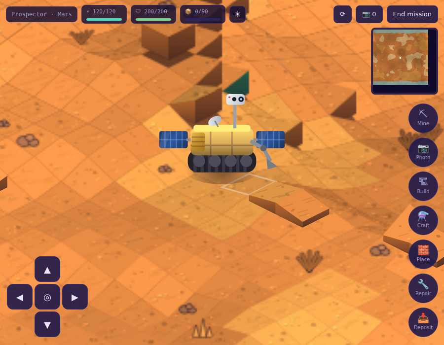
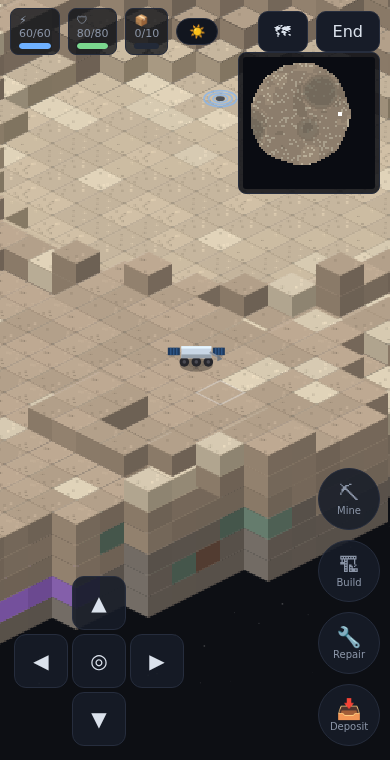

# TakeOn — rover missions

A modular, isometric **voxel rover game**: build a rover from parts, launch it
at a planet, moon or asteroid, then drive it on a procedurally generated voxel
surface — mine resources, take photos, scan for anomalies, make discoveries
and construct ground infrastructure. Battery, fuel and durability all matter.

TakeOn is designed to run **standalone** (this repo ships a Next.js app) and to
**embed as a module** inside other games — in particular PixiJS-based hosts
like [Landnam](https://github.com/Signal-K/planet-hunters-experiment-1) — via
`@takeon/pixi`.

<p>
 
</p>

## Repository layout

| Path | What it is |
|---|---|
| `packages/engine` | `@takeon/engine` — the whole game as a zero-dependency TypeScript library: voxel worlds, terrain gen, isometric renderer (Canvas 2D, chunk-cached), rover simulation, parts/customiser maths, actions, persistence adapters |
| `packages/pixi-adapter` | `@takeon/pixi` — mounts a mission inside an existing PixiJS stage (v7/v8) |
| `web` | Standalone Next.js app: garage, customiser, destination picker, mission HUD. Mobile-friendly (touch d-pad, pinch zoom, tap-to-drive) |
| `pocketbase` | Go PocketBase **spoke** backend (port 8094) following the Star Sailors hub-and-spoke pattern: JS `pb_migrations`, custom `/api/takeon/*` routes, auth delegated to the shared backend, discovery cross-post hook |
| `docs/INTEGRATION.md` | How to embed TakeOn in Landnam / any PixiJS game, or behind your own storage |

## Quick start (no backend needed)

```bash
npm install
npm run build          # engine → pixi adapter → web
npm run dev            # http://localhost:3400
```

The web app persists to `localStorage` when no backend is configured — fully
playable offline.

## Gameplay

- **Customiser** — chassis, drivetrain, power source and battery are required;
  chassis slots hold optional modules: mining tool, camera, scanner, extra
  cargo, fuel tank. Every part changes derived stats (mass slows you and raises
  per-tile drive cost; tracks climb 3 voxels but crawl; RTG charges at night
  where solar dies). Parts cost credits; missions earn them back.
- **Destinations** — Moon, Mars, Europa, Ceres, Bennu, Io. Real relative
  gravity, sunlight and delta-v: your fuel capacity gates what you can reach,
  gravity scales fall damage, solar flux scales charging, day length drives the
  day/night cycle. Bennu is an irregular rubble pile with map-edge cliffs.
- **On the surface** — drive (keys, touch d-pad, or tap-to-drive), rotate the
  isometric perspective in 90° steps (R), mine the voxel terrain (materials
  have hardness and yields; ores live in veins), photograph anomalies to
  document discoveries, scan to reveal them, build structures from cargo
  (solar array, nav beacon, auto-drill rig, supply cache, refinery, habitat
  frame), place stone blocks to terraform ramps and bridges (B), and repair
  with stone+iron.
- **Crafting & refining** — refine iron into plates, silica into glass, ice
  into water on the rover; park beside a built refinery to smelt Ti-alloy.
  Refined goods outvalue their inputs and gate the habitat frame.
- **Mission end** — banked cache deposits, cargo, photos and documented
  discoveries convert to credits. A rover that runs out of battery with no way
  to recharge — or breaks its chassis — is lost.

Worlds are generated deterministically from `(body, seed)`, so saves only
persist voxel *edits* plus rover/structure state; resume is byte-faithful.

## Real planetary data

Two data channels feed generation:

- **Topography** — Mars and the Moon reference embedded DEM patches sampled
  from real elevation models (NASA MGS **MOLA** for Mars/Jezero, LRO **LOLA**
  for Mare Imbrium). Run `node scripts/fetch-dem.mjs` (needs network access to
  trek.nasa.gov, then rebuild the engine) to populate
  `packages/engine/src/world/dem/generated.ts`; without the data the engine
  falls back to procedural relief, so nothing breaks in sandboxes/CI. The
  script also writes a manifest (`dem/expected.ts`) that `test/dem.test.ts`
  checks, so once fetched the data can't silently regress to the fallback.
- **Spectroscopy-informed mineralogy** — each body carries `minerals` vein
  weights derived from published surveys: TES/GRS hematite abundance makes
  Mars iron-dominated; Clementine UVVIS / M3 TiO₂ maps make the lunar maria
  titanium-rich. Any body row in `takeon_bodies` can override them.

## Backend (optional): PocketBase spoke

```bash
cd pocketbase
TAKEON_ALLOW_ANON=true go run . serve --http 0.0.0.0:8094
```

| Env | Meaning |
|---|---|
| `SHARED_PB_URL` | Shared Star Sailors backend (identity hub, default `http://127.0.0.1:8090`) |
| `TAKEON_ALLOW_ANON=true` | Accept unauthenticated players as `anon` (dev/standalone) |
| `SAILY_PB_URL` + `SAILY_INTERNAL_API_KEY` | Enable discovery cross-posting (idempotent, keyed by `userId:anomalyId`) |

Auth follows the ecosystem pattern: the client logs into the **shared**
backend; this spoke verifies the JWT by delegating to
`/api/collections/users/auth-refresh` (cached 5 min). All gameplay writes go
through `/api/takeon/*` routes; collections stay superuser-locked. Collections
are created by JS migrations in `pb_migrations/` (Landnam convention); the
part/body catalog is seeded from `seed/*.json`, regenerated from the engine via
`node scripts/export-catalog.mjs`.

Point the web app at it with:

```bash
NEXT_PUBLIC_TAKEON_PB_URL=http://127.0.0.1:8094 npm run build -w takeon-web
```

Or run everything with Docker: `docker compose up`.

## Embedding in a PixiJS game (Landnam)

```ts
import * as PIXI from 'pixi.js';
import { getBody } from '@takeon/engine';
import { mountRoverGame } from '@takeon/pixi';

const mounted = mountRoverGame({
  pixi: PIXI,
  stage: app.stage,
  ticker: app.ticker,
  view: app.canvas,          // host canvas: wires keyboard/touch/tap input
  width: 800, height: 600,
  body: getBody('mars')!,
  spec: playerRover,         // a RoverSpec, e.g. from your own DB
});
mounted.game.start();
mounted.game.events.on('anomalyDocumented', ({ anomaly }) => { /* award XP */ });
// later: mounted.destroy();
```

See [docs/INTEGRATION.md](docs/INTEGRATION.md) for the event catalogue and how
to supply a custom `SyncAdapter` so mission data lands in *your* database.

## Tests

```bash
npm test               # engine unit tests (terrain determinism, sim, economy)
```

## Performance notes

- Terrain is composited from cached per-chunk canvases; a frame is ~30 blits +
  entities, comfortably 60 fps on mid-range phones. Chunks rebuild only when a
  voxel changes.
- The sim runs at a fixed 10 Hz decoupled from rendering; rover movement is
  interpolated.
- The whole standalone app is static-exportable; first-load JS is ~125 kB.
